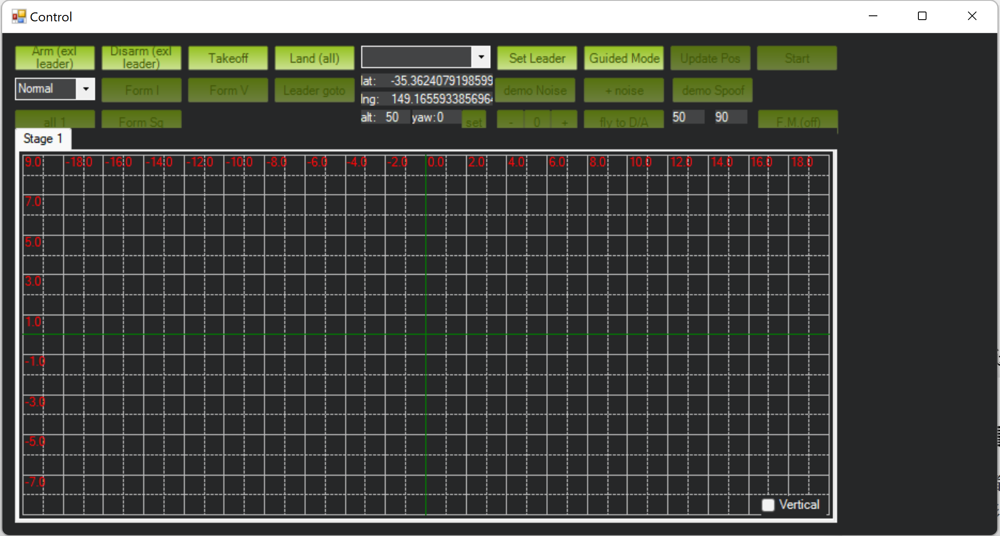
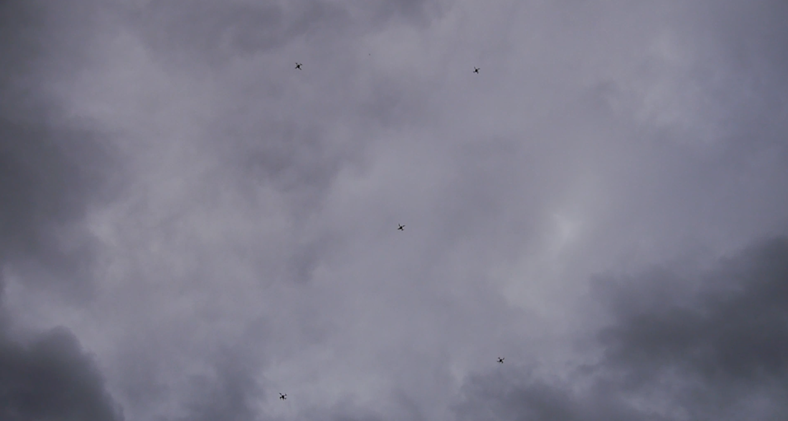
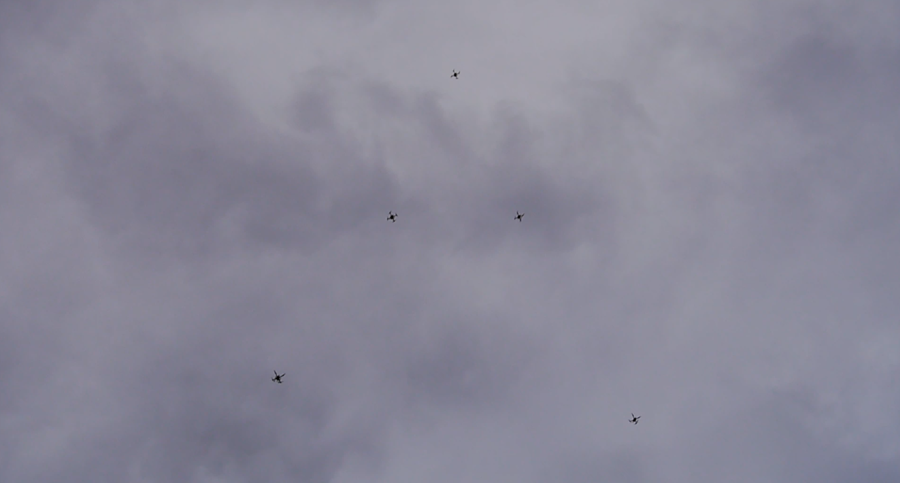

# Extended swarm function of Mission Planner for localization, state estimation, collision avoidance

This is the preliminary version of the mission.

Extend the original swarm function in [Mission Planner](https://github.com/ArduPilot/MissionPlanner). The interface are re-designed and more functionalities are added, such as the naive formation control, leader following, taking off/landing sequentially, display of distance matrix and etc.. 

The major modification is in the folder MissionPlanner/Swarm/

# Demo

## Screenshot

The screenshot shows the modified swarm function of Mission Planner, where some other functions are added, such as control of formations, sequential taking off/landing, leader-flying-to, etc..

## Real flight demo
The the screenshot of videos of flight experiment

